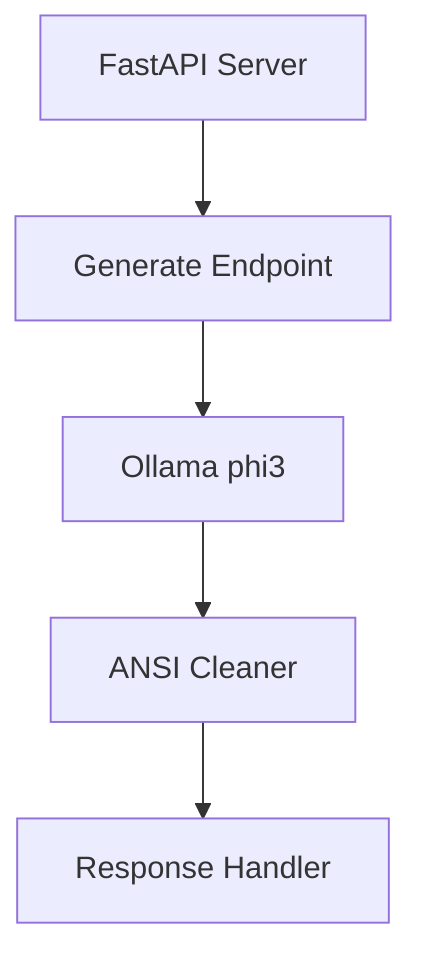
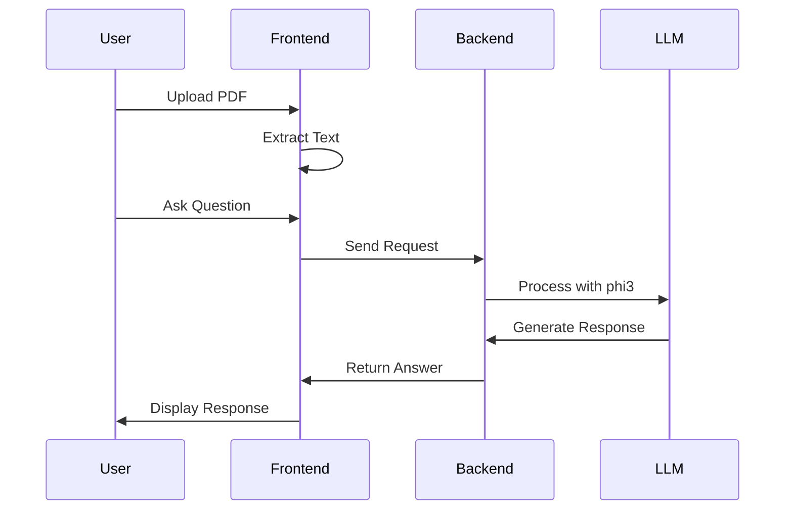

# PDF AI Interaction App 🤖📄

[](https://fastapi.tiangolo.com/)
[](https://www.python.org/)
[](https://www.qt.io/)
[](https://streamlit.io/)

An intelligent PDF interaction system with two frontend implementations, powered by a FastAPI backend and Ollama's phi3 model. Ask questions about your PDF documents and receive AI-generated responses!

## 🌟 Features

- **PDF Processing**: Extract and analyze text from PDF documents
- **AI Integration**: Natural language interaction using phi3 model
- **Conversation Memory**: Maintains chat history for context-aware responses
- **Dual Frontend Options**: Choose between desktop (PyQt5) or web (Streamlit) interface
- **Robust Backend**: FastAPI server with error handling and clean output processing

## 🏗️ System Architecture

### Backend (`backend.py`)


### Data Flow


## 💫 Implementation Details

### Frontend Options

#### 🖥️ PyQt5 Desktop App
- Native system integration
- Real-time updates
- System file dialogs
- Local resource access
- In-memory state management

#### 🌐 Streamlit Web App
- Browser-based interface
- Session state persistence
- Reactive components
- Web file upload
- Automatic UI updates

### Backend Features
- FastAPI with Pydantic models
- Ollama phi3 integration
- ANSI sequence cleaning
- Robust error handling
- Environment configuration

## 🚀 Getting Started

1. Clone the repository
2. Install dependencies:
```bash
pip install -r requirements.txt
```

3. Start the backend:
```bash
uvicorn backend:app --reload
```

4. Launch your preferred frontend:
```bash
# For PyQt5
python pyqt_app.py

# For Streamlit
streamlit run streamlit_app.py
```

## 📊 Technical Comparison

| Feature | PyQt5 | Streamlit |
|---------|-------|-----------|
| Architecture | Desktop Native | Web-Based |
| State Management | In-Memory | Session-Based |
| UI Updates | Real-Time Events | Page Rerenders |
| File Handling | System Dialogs | Web Upload |
| Threading | Synchronous | Asynchronous |

## ⚙️ Key Features
- 10,000 character PDF content limit
- Conversation history tracking
- Error handling and recovery
- Clean architecture design
- Fast response generation
- Multiple frontend options

---
Made with ❤️ using Python, FastAPI, PyQt5/Streamlit, and Ollama
